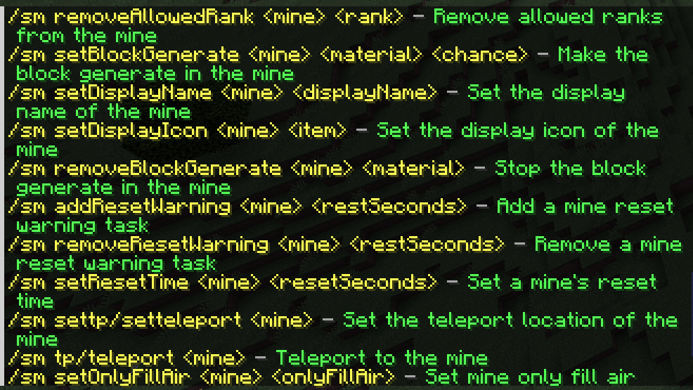
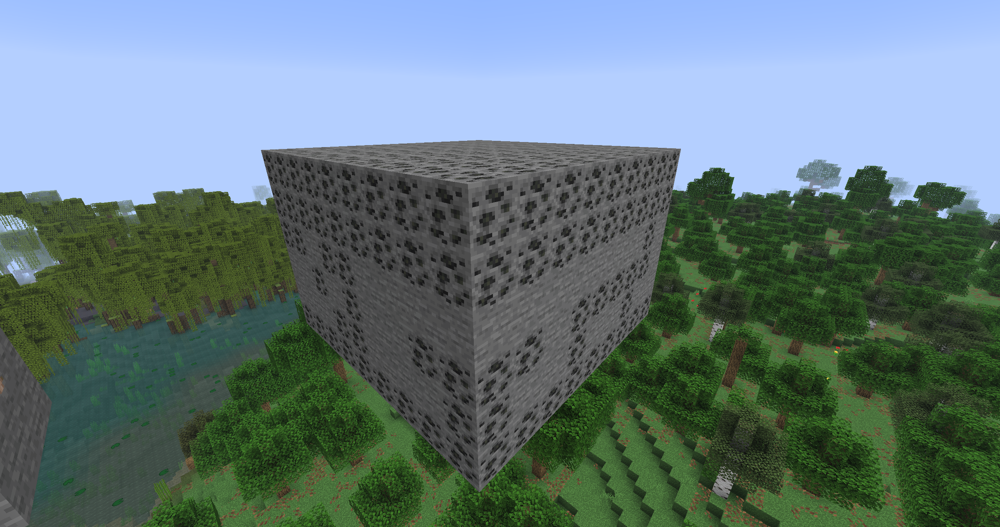
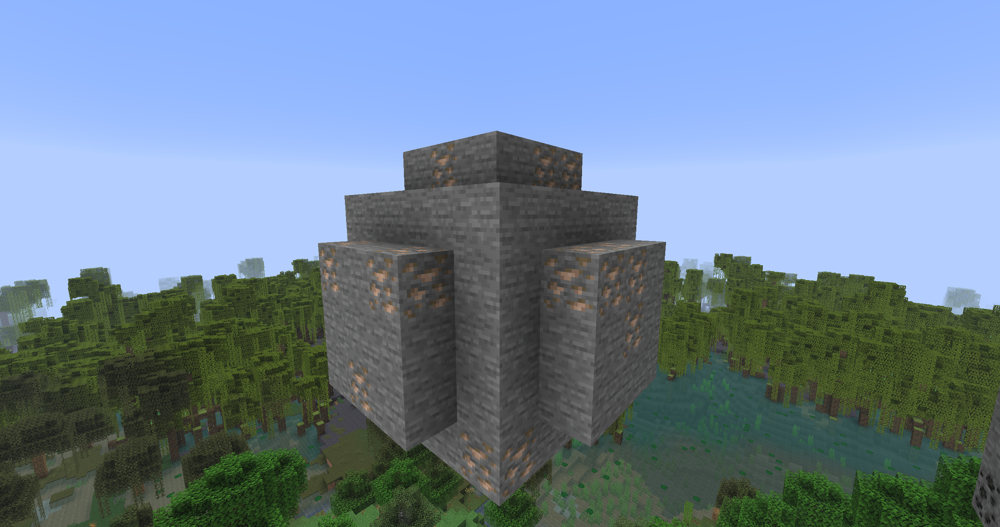
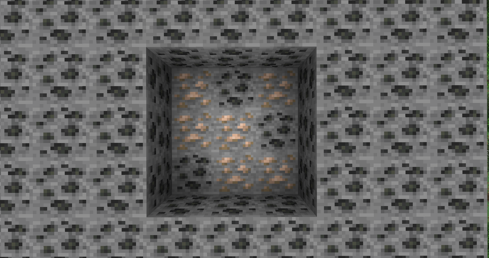

<h1>SuperMines</h1>

SuperMines 是一款免费开源的 Paper 矿区插件，用自动重置、条件化生成和游戏内管理，减少服主维护矿区的重复工作。

[English](README.md)

## 其他插件的痛点

- **生成规则单一**：不少矿区方案仍以“方块 + 百分比”的随机池为主，很难表达表层、指定高度、边界、内部或生物群系等位置规则。
- **管理依赖配置文件**：新增方块、调整权重或修改矿区时经常需要编辑 YAML、重载插件，日常运营不够直观。
- **功能被拆成多个插件**：自动拾取、挖掘等级、宝藏奖励和单点复生通常需要额外插件补齐，配置与权限容易分散。
- **只会整区重置**：传统矿区往往只能定时填充整个选区，难以处理独立矿石、资源节点或不同复生周期。
- **扩展能力有限**：缺少生成条件组合和完整事件 API 时，服主很难接入自定义玩法或让其他插件安全干预流程。

## SuperMines的亮点

- **2 种矿区形状**：支持长方体选区和球形矿区，并按设定周期自动重置。
- **8 种生成条件**：提供表层、矿区相对 Y、边界、生物群系、占位符，以及 AND、OR、NOT 组合条件。
- **独立可再生矿点**：每个矿点单独计时，支持加权方块池、持久化倒计时和 `0-100%` 独立宝藏概率。
- **游戏内管理**：通过 GUI 管理矿区、方块权重、生成条件、宝藏、等级和可再生矿点。
- **玩家挖矿体验**：支持矿区/玩家两级自动拾取、按挖掘量成长的等级，以及可选 mcMMO / AuraSkills 经验。
- **4 个自定义方块平台**：支持 ItemsAdder、Oraxen、Nexo 和 CraftEngine。
## 变量

> `[参数]` 表示可选参数  
> `<参数>` 表示必填参数

### PlaceholderAPI

| 变量 | 返回内容 |
| --- | --- |
| `%supermines_bestrank[_玩家名]%` | 最高等级的显示名；省略玩家名时读取当前玩家 |
| `%supermines_biggestranklevel[_玩家名]%` | 拥有的最高等级数值；省略玩家名时读取当前玩家 |
| `%supermines_minedblocks[_玩家名]%` | 累计挖掘方块数；省略玩家名时读取当前玩家 |
| `%supermines_hasrank_<等级ID>[_玩家名]%` | 是否拥有指定等级；省略玩家名时读取当前玩家，返回 `true` / `false` |
| `%supermines_treasures_got_<宝藏ID>[_玩家名]%` | 指定宝藏获取次数；省略玩家名时读取当前玩家 |
| `%supermines_mine_<矿区ID>_<类型>%` | 返回指定矿区的运行数据，类型见下表 |

### MiniPlaceholders

| 变量 | 返回内容 |
| --- | --- |
| `<supermines_bestrank[:玩家名]>` | 最高等级的显示名；省略玩家名时读取当前玩家 |
| `<supermines_biggestranklevel[:玩家名]>` | 拥有的最高等级数值；省略玩家名时读取当前玩家 |
| `<supermines_minedblocks[:玩家名]>` | 累计挖掘方块数；省略玩家名时读取当前玩家 |
| `<supermines_hasrank:<等级ID>[:玩家名]>` | 是否拥有指定等级；省略玩家名时读取当前玩家，返回 `true` / `false` |
| `<supermines_treasures_got:<宝藏ID>[:玩家名]>` | 指定宝藏获取次数；省略玩家名时读取当前玩家 |
| `<supermines_mine:<矿区ID>:<类型>>` | 返回指定矿区的运行数据，类型见下表 |

### 注意

矿区不存在时返回 `MINE_NOT_FOUND`，类型无效时返回 `INVALID_ARGUMENT`。

## 未来

下一步计划：

- 随机矿区事件：幸运时段和双倍掉落。
- 更新检查。
- 重新规整变量，添加再生矿点相关变量。

## 截图

### 指令帮助

### 长方体矿区

### 球形矿区

### 边界条件：内部

下图中的铁矿仅生成在矿区内部。

## API

请参阅 [API 类](https://github.com/LinsMinecraftStudio/SuperMines/blob/main/src/main/java/io/github/lijinhong11/supermines/api/SuperMinesAPI.java)
